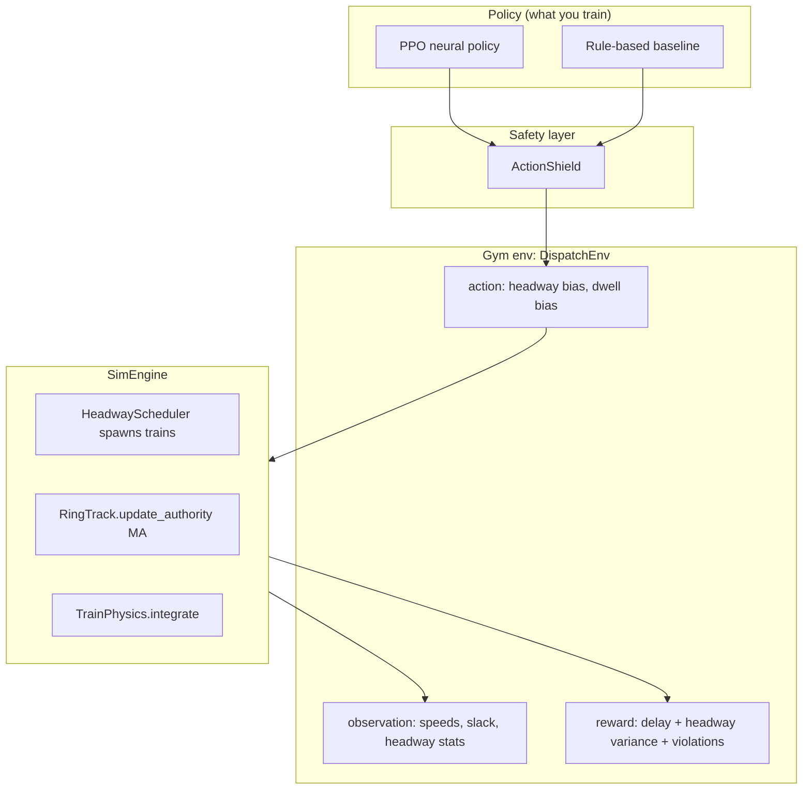

# How the ML stack works

This guide explains the **dispatch RL** code under `ml/rlcbtc/` and how it relates to the **backend** simulator in `backend/`. It follows the intent in `docs/PROJECT.md`: classical control first, RL as an optional layer on top of a trustworthy physics + safety core.

## Mental model



**Important:** RL does **not** directly set train speed every millisecond. The action vector nudges **dispatch knobs** (target headway, dwell bias). Underneath, the same style of **ATP / moving-block** logic as the backend caps traction when `atp_slack_m` is too small.

## Backend vs ML (shared concepts)

| Concept | Backend (`backend/`) | ML (`ml/rlcbtc/sim/`) |
|--------|----------------------|------------------------|
| Chainage on a ring | `route_geom.py` | `track.py` |
| MA / safe separation | `zone_controller.py` | `RingTrack.update_authority` |
| Train dynamics | `train.py` | `physics.py` |
| Orchestration | `sim.Simulation` | `sim_engine.SimEngine` |

Numbers use the same **Urbalis-style sketch** (fixed margin + closing distance over MA cycle + braking distance). This is for learning and visualization, not certification.

## One RL step (what happens when you call `env.step`)

1. **Policy** outputs `action ∈ [-1,1]²` (headway correction, dwell correction).
2. **ActionShield** may clamp the action if speed or `min_slack_m` violates `Constraints`.
3. **SimEngine** applies biases, may spawn a train via `HeadwayScheduler`, runs **authority update** then **physics integration** for every train for `dt_seconds`.
4. **Observation** builder normalizes fleet means (speed, slack, headway std, delays, …).
5. **Reward** = `-delay - 0.25·headway_variance - 10·violations - 1·shield_intervention` when the shield overrides the proposed action (see `envs/reward.py`).

## Training

```bash
cd ml
python -m venv .venv && source .venv/bin/activate
pip install -r requirements.txt

# Fast baseline + traces (no GPU)
python -m rlcbtc.cli.train --config configs/experiments/rule_based_smoke.yaml

# PPO (shorten total_timesteps in yaml for a smoke run)
python -m rlcbtc.cli.train --config configs/experiments/ppo_baseline.yaml
```

Artifacts land in `ml/runs/<name>/latest/`:

- `config.json` — frozen experiment config
- `train.log` — CLI + runner logs (stderr mirrors this with `-v` for debug)
- `metrics.jsonl` — PPO training rollout stats (one JSON line per SB3 rollout)
- `traces/steps.jsonl` — per-step metrics for replay / debugging (every algo after train)
- `evaluation.json` — aggregates from `evaluation/metrics.py`
- `policy.zip` — SB3 model (PPO only)

## Evaluation & replay

`evaluation/replay.py` logs each step’s delay, headway std, violations, and whether the shield intervened. Use this to answer: *“At step 842, why did headway spike?”* without rerunning blindly.

```bash
python -m rlcbtc.cli.evaluate --run-dir runs/rule_based_smoke/latest
```

## Safety layer

- `Constraints` — caps (max speed, min authority buffer, …).
- `ActionValidator` — cheap checks on state.
- `ActionShield` — if unsafe or slack &lt; buffer, force friendlier headway (`fallback_action` or bump `action[0]`).
- Interventions are logged into traces for **offline audit** (see `ml/docs/SAFETY.md`).

## What RL is *for* here

The research question is **dispatch**: when to insert trains, how aggressively to regulate headway under noise — not replacing ATP. Once the sim is trustworthy, you compare:

1. **Rule-based** (`policies/rule_based.py`) — interpretable regulator.
2. **PPO** — learns nonlinear corrections from reward.

Use `cli/compare.py` (existing) once both runs exist under `runs/`.

## Suggested reading order in code

1. `sim/physics.py` — traction curve + ATP cap
2. `sim/track.py` — gap / EOA
3. `sim/world.py` + `sim_engine.py` — tick loop
4. `envs/dispatch_env.py` — Gym API
5. `safety/shield.py`
6. `experiments/runner.py` — wires training
